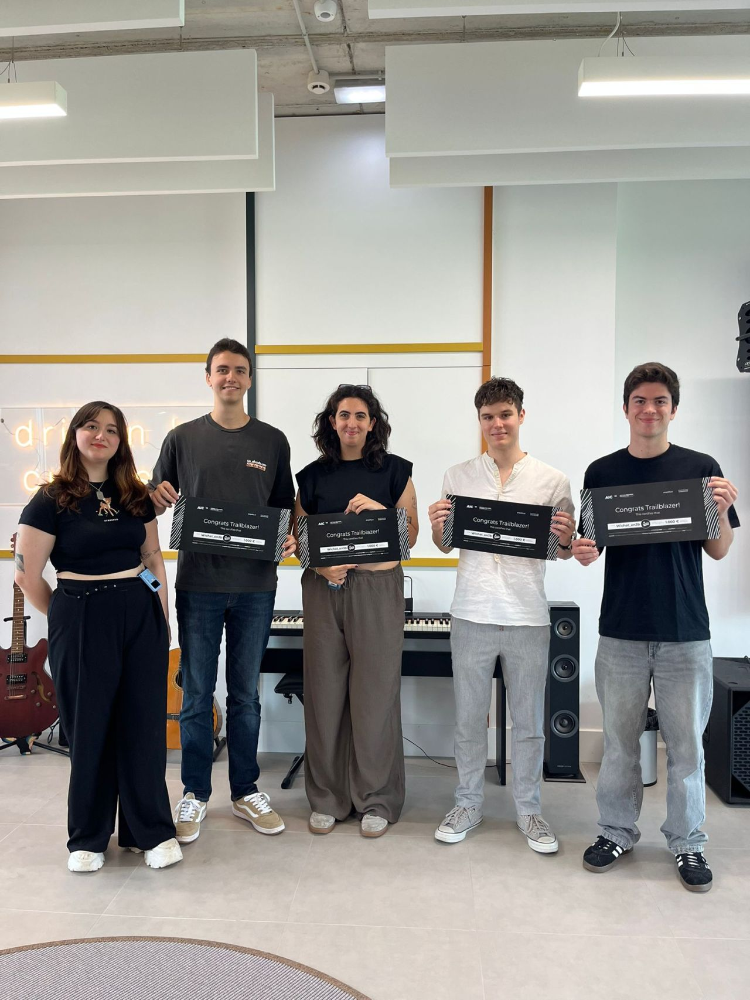
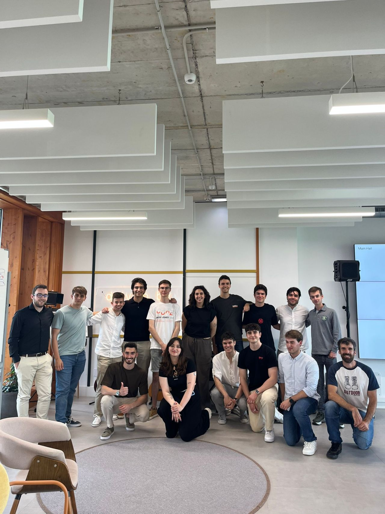

🎓 Hace más de un mes celebramos en las oficinas de Empathy.co la ceremonia de entrega de premios del **Empathy AI Challenge 2025**.

Organizar este evento ha sido una **experiencia muy especial para mí**, por eso quería compartir este último post en castellano, el idioma que hablo cada día y que siento más cercano.

Siempre me ha gustado organizar eventos, se me da bien y disfruto el proceso. Por eso **agradezco a Empathy la oportunidad de crear este evento desde cero**, pudiendo planificar y decidir los detalles tal y como sentía que debían ser.

Mientras lo preparaba, **no podía evitar recordar cómo viví el challenge hace años, cuando participé como estudiante**. Esa experiencia me pareció muy especial y esta vez me tocó estar al otro lado, con la ilusión y la responsabilidad que eso implica.

Conté con el apoyo de muchas personas, tanto dentro de Empathy (equipos de diseño, GenAI, devOps, web...) como fuera, y eso fue fundamental para que todo saliera bien, ya que el **trabajar en equipo y con respeto es lo que nos hace fuertes** 😉

El día de la ceremonia todo fue fluido y los asistentes disfrutaron mucho. Creo que estuve a la altura de un momento tan especial, aunque ellos lo pusieron fácil con su interés y participación.

🎁 Si he tardado en hablar de esto es porque estábamos preparando una **sorpresa**:

**Ahora en la web oficial del challenge hay una sección con todos los ganadores y participantes**, que quedará como recuerdo de todo el esfuerzo y talento desplegado:

https://lnkd.in/dNWQhKzR

Gracias a todos los que hicieron posible esta edición 😊

-----

> Publicación original en LinkedIn (en inglés) [aquí](https://www.linkedin.com/posts/empathyco_aichallenge2025-universityofoviedo-artificialintelligence-activity-7341460890929487875-ZAeq?utm_source=share&utm_medium=member_desktop&rcm=ACoAADEI1i4BFXWt3-bLEY8rcEBLyHBQzmp5Jto)
